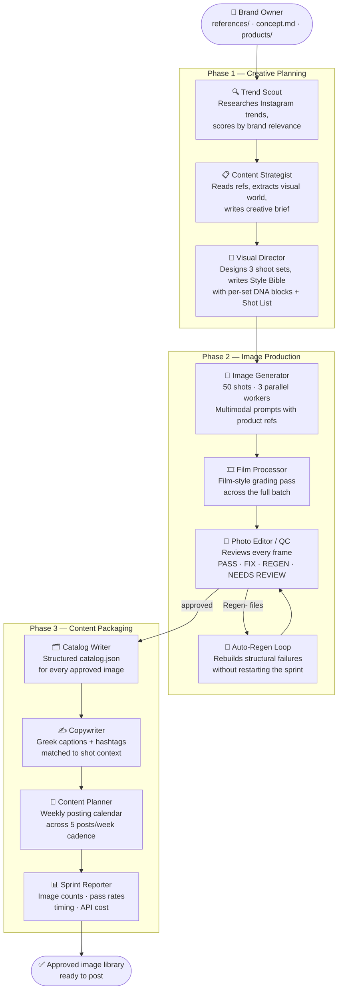

# Lunchbag — Agentic Content Production System

An autonomous agentic pipeline that runs a complete monthly Instagram content sprint for a product brand. Drop in reference images on Monday. Receive a fully shot, reviewed, captioned, and scheduled content library by end of day — no photographer, no copywriter, no content planner required.

Built with CrewAI and Google Gemini. Designed for **The Lunchbags**, a Greek cotton lunch bag brand.

---

## What it does

Most brand Instagram workflows look like this: brief a photographer → wait → review → reshoot → write captions → plan calendar → post. Each hand-off takes days.

Lunchbag collapses that entire loop into a single command. A crew of specialized agents handles every step — from reading your moodboard to writing Greek captions — while a pipeline monitor tracks progress, retries failures, and hands you a sprint report at the end.

**One sprint produces:**
- ~50 reviewed, QC-approved product images across 3 shoot sets
- Film-processed variants of every approved image
- Greek Instagram captions and hashtag sets for every image
- A weekly posting calendar for the next 5 weeks
- A sprint report with image counts, pass rates, and API cost breakdown

---

## Agent diagram



---

## End-to-end workflow

### Phase 1 — Creative planning

**Campaign concept** (optional, human-authored)
Drop a `concept.md` file describing the campaign narrative — location, energy, props, model direction. If omitted, agents derive direction entirely from the reference images.

**Trend Scout**
Researches what is performing on Instagram this week — trending formats, hashtags, and competitor moves. Scores every trend by relevance to the brand and flags anything urgent. Feeds findings to the Content Strategist.

**Content Strategist**
Reads the reference images folder and the campaign concept. Extracts the visual world precisely — setting, lighting, props, subject presence, mood, composition style. Produces a creative brief specific enough for a director to execute without a follow-up question.

**Visual Director**
Designs 3 complete shoot sets that match the world of the reference images. Writes a Style Bible with a DNA Prompt Block per set — a locked lighting and aesthetic specification that keeps all images in a set cohesive. Writes a Shot List of 50 compositions with exact product variant, model presence, angle, and subject distance for every frame. Reviews all 3 sets side-by-side before submitting to ensure equal depth and quality.

---

### Phase 2 — Image production

**Image Generator**
Executes the full Shot List in one continuous run. Sends every shot as a multimodal prompt to Gemini — product reference images, style references, and the DNA Prompt Block for that set — and saves each result to the asset library. Runs 3 concurrent workers for ~3× throughput. Hard constraints prevent structural errors (shoulder straps, wrong bag model) from being generated in the first place.

**Film Processor**
Applies a film-style grading pass to every generated image, ensuring consistent color and tone across the batch.

**Photo Editor / QC**
Reviews every image against the product references. For each frame:
- **PASS** — image approved, added to catalog
- **FIX** — minor issue (color, framing), attempts up to 3 targeted corrections
- **REGEN** — structural failure (shoulder strap, wrong shape, wrong scale) that cannot be fixed by editing — flagged for full regeneration
- **NEEDS REVIEW** — non-structural issue requiring human judgment

Saves a checkpoint after every image. If the process disconnects mid-set, it resumes from where it left off on next run.

**Auto-Regen Loop**
After the QC pass, any `Regen-` files are automatically regenerated in a second pass — new generation → film processing → QC → catalog update — without restarting the sprint. Limited to one round per set to prevent loops.

---

### Phase 3 — Content packaging

**Catalog Writer**
Writes a structured `catalog.json` for the full shoot — shot code, product variant, set, approval status, file path, and QC notes for every image.

**Copywriter**
Writes a Greek-language Instagram caption and hashtag set for every approved image. Captions match the shot context — a detail close-up gets different copy than a lifestyle scene.

**Content Planner**
Builds a weekly posting calendar using the approved image library, scheduled across the brand's 5 posts/week cadence.

**Sprint Reporter**
Generates a final sprint report: image counts by set, first-pass approval rates, regen count, total wall-clock time, and estimated Gemini API cost.

---

## Resilience

| Situation | Behaviour |
|---|---|
| Server disconnect mid-set | Photo editor resumes from last checkpoint on next run |
| Structural image failure (strap, wrong model) | Auto-regenerated in a second pass — no manual restart |
| Transient API error | Retries up to 3 times with 10s backoff |
| Daily quota exhausted | Pipeline stops cleanly with a clear message |
| Code bug (wrong API attribute, bad import) | Exits immediately — never retries a programming error |

---

## Setup

**Prerequisites:** Python 3.12, a [Gemini API key](https://aistudio.google.com)

```bash
git clone https://github.com/tzinisp-spec/lunchbag.git
cd lunchbag
python3.12 -m venv test_env
source test_env/bin/activate
pip install crewai google-genai python-dotenv
```

Create `.env` in the project root:

```env
GEMINI_API_KEY=your_gemini_api_key
GOOGLE_API_KEY=your_google_api_key
MODEL=gemini/gemini-2.5-pro
```

Add your content:
- Product photos → `products/` (`.jpg` or `.png`)
- Moodboard references → `references/Set1/`, `references/Set2/`, `references/Set3/` (3–6 images each)
- Campaign narrative (optional) → `concept.md`

---

## Running a sprint

```bash
cd /path/to/lunchbag
./test_env/bin/python3 main.py
```

The pipeline runs end-to-end autonomously. Progress prints to the terminal as each step completes. Find outputs in `asset_library/` and `outputs/` when done.

---

## Configuration

Edit the `INPUTS` dictionary in `main.py`:

```python
"brand_name":        "The Lunchbags"
"current_season":    "Spring 2026"
"images_per_sprint": "50"          # use 10 for a test run
"posts_per_week":    "5"
"content_mix":       "35% bag in use, 25% product only, ..."
"shoot_dont_list":   "No white studio backgrounds, ..."
```

---

## Output structure

```
asset_library/
  images/
    {year}-{month}/
      Shoot{N}/
        Set1/              ← approved images
        Set2/
        Set3/
        catalog.json       ← structured image catalog

outputs/
  style_bible_and_shot_list.md
  sprint_reports/
    sprint_report_{shoot_id}.md
  weekly_calendar_{shoot_id}.md
```

---

## Stack

| Layer | Technology |
|---|---|
| Agent orchestration | [CrewAI](https://crewai.com) |
| LLM & image generation | [Gemini 2.5 Pro](https://deepmind.google/gemini) |
| Runtime | Python 3.12 |
